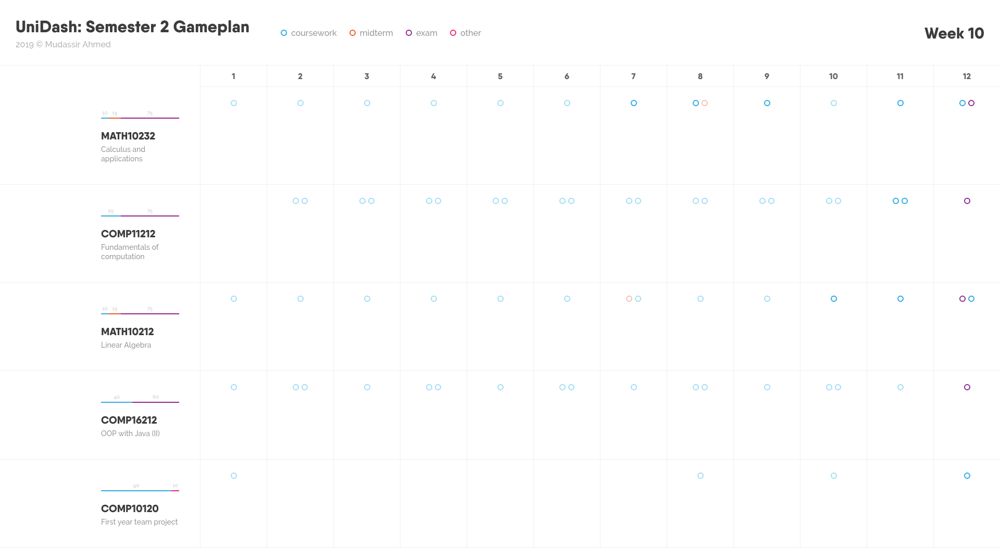

# UniDash - Manage your semester workflow

## Demo (image)

## Technologies used:
HTML5, CSS3, JavaScript, nodejs (and expressjs) and MongoDB

Side note:

The code could be written better - I know :)
